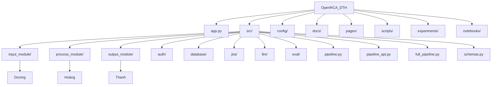

# OpenRCA_DTH — Logistics / Delivery Platform RCA

OpenRCA_DTH is an **LLM-assisted Root Cause Analysis (RCA) system** for a Logistics / Delivery Platform.

The system analyzes incident information together with **metrics, logs, and traces** to identify the most likely root cause, affected component, and reason.

Inspired by Microsoft's [OpenRCA](https://github.com/microsoft/OpenRCA) research.

---

## Architecture

```text
Incident Query
      │
      ▼
┌──────────────┐
│ INPUT MODULE │
│    Dương     │
└──────┬───────┘
       ▼
┌────────────────┐
│ PROCESS MODULE │
│     Hoàng      │
└──────┬─────────┘
       ▼
┌───────────────┐
│ OUTPUT MODULE │
│     Thanh     │
└──────┬────────┘
       ▼
   RCA Result
```

The modules communicate through the shared schemas defined in:

```text
src/schemas.py
```

---

## Module Ownership

| Module             | Developer | Documentation                                                  |
| ------------------ | --------- | -------------------------------------------------------------- |
| **Input Module**   | Duong Nguyen     | [`src/input_module/README.md`](src/input_module/README.md)     |
| **Process Module** | Hoang Nguyen     | [`src/process_module/README.md`](src/process_module/README.md) |
| **Output Module**  | Thanh Bui     | [`src/output_module/README.md`](src/output_module/README.md)   |

Each module has its own README containing detailed information about its implementation.

---

## Installation

### 1. Clone the repository

```bash
git clone <repository-url>
cd OpenRCA_DTH
```

### 2. Create a virtual environment

**Windows**

```powershell
python -m venv .venv
.venv\Scripts\activate
```

**Linux / macOS**

```bash
python3 -m venv .venv
source .venv/bin/activate
```

### 3. Install dependencies

```bash
pip install -r requirements.txt
```

---

## Database Setup

OpenRCA_DTH uses **PostgreSQL** for investigation and RCA data.

The project does not require the development team's database. Users should configure their own compatible PostgreSQL database.

Create a database:

```sql
CREATE DATABASE openrca;
```

Configure the database connection in `.env`:

```env
DB_HOST=<database-host>
DB_PORT=5432
DB_NAME=openrca
DB_USER=<database-user>
DB_PASSWORD=<database-password>
```

Additional environment variables, such as the Gemini API key, should also be configured in `.env`.

> Never commit `.env` or API credentials to Git.

---

## Run the Application

### Pipeline API

Start the FastAPI pipeline:

```bash
uvicorn src.pipeline_api:app --host 0.0.0.0 --port 8000
```

API:

```text
http://localhost:8000
```

API documentation:

```text
http://localhost:8000/docs
```

### Streamlit

Open another terminal and run:

```bash
streamlit run app.py
```

Application:

```text
http://localhost:8501
```

---

## Project Structure



---

## Documentation

Detailed documentation is available in each main module:

* **Input Module** — `src/input_module/README.md`
* **Process Module** — `src/process_module/README.md`
* **Output Module** — `src/output_module/README.md`

Additional project documentation is available in:

```text
docs/
```

---

## Acknowledgements

We would like to express our sincere gratitude to:

**Mr. Huynh Ngoc Thien** — our direct supervising lecturer, for his guidance and support throughout the project.

**AI tools** — for assisting with code development, debugging, documentation, and technical exploration.

**Project team members** — for their collaboration and contributions to the development of OpenRCA_DTH.

*This project is based on and inspired by Microsoft's OpenRCA research and implementation. Since OpenRCA_DTH is an adaptation of the original project for our Logistics / Delivery Platform scenario, some implementation differences or limitations may occur.*