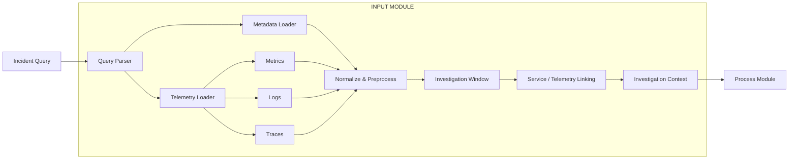

# OpenRCA_DTH — Input Module

## Input Module Overview

The **Input Module** is the data ingestion and preparation layer of the OpenRCA_DTH Root Cause Analysis (RCA) pipeline.

It receives an incident query, loads the required metadata and telemetry data, prepares the investigation time window, normalizes the data, and builds the investigation context for the Process Module.

The Input Module supports three main telemetry types:

* **Metrics**
* **Logs**
* **Traces**

Its main purpose is to provide the Process Module with clean, structured, and investigation-ready data.

---

## Input Module Flow



---

# Installation

## 1. Clone the Repository

```bash
git clone <repository-url>
cd OpenRCA_DTH
```

## 2. Create a Virtual Environment

### Windows

```powershell
python -m venv .venv
.venv\Scripts\activate
```

### Linux / macOS

```bash
python3 -m venv .venv
source .venv/bin/activate
```

## 3. Install Dependencies

```bash
pip install -r requirements.txt
```

The Input Module primarily relies on the project's Python runtime dependencies for data loading, configuration, database connectivity, and telemetry processing.

---

# Database Setup

The Input Module requires access to a **PostgreSQL database** containing the telemetry and metadata required by the RCA pipeline.

> The project does not require users to use the original development dataset. You can connect the Input Module to your own compatible PostgreSQL database and telemetry data.

## 1. Create a PostgreSQL Database

Create a database for your OpenRCA deployment:

```sql
CREATE DATABASE openrca;
```

You may use a different database name if required.

## 2. Configure Database Connection

Create a `.env` file in the project root.

Example:

```env
DB_HOST=localhost
DB_PORT=5432
DB_NAME=openrca
DB_USER=<your_username>
DB_PASSWORD=<your_password>
```

Use the credentials and connection details of your own PostgreSQL environment.

## 3. Prepare the Database

The database should contain the tables required by the OpenRCA_DTH pipeline.

The exact schema depends on the version of the project and the telemetry sources being used.

Before running the pipeline, make sure that:

* PostgreSQL is running
* The configured database is accessible
* The configured user has permission to read the required tables
* Required telemetry and metadata are available

You can verify the database connection using:

```bash
psql -h <host> -p <port> -U <username> -d <database>
```

Then:

```sql
\dt
```

to list the available tables.

---

# Telemetry Data

The Input Module is designed to work with observability data from three main categories:

```text
Telemetry
├── Metrics
├── Logs
└── Traces
```

The actual data source and table/file names may vary depending on the deployment.

The telemetry data should provide enough information to:

* Identify the affected service
* Associate telemetry with services
* Locate records within the incident time range
* Support cross-telemetry investigation

The Input Module is responsible for loading and preparing this information before it is passed to the Process Module.

---

# Configuration

Project configuration is managed through the project's configuration files and environment variables.

Before running the application, verify that:

* Database settings are correct
* Telemetry configuration points to the intended data source
* Required API credentials are configured
* The selected environment matches your deployment

Sensitive credentials such as database passwords and API keys should be stored in `.env` rather than committed to Git.

---

# Running the Input Module

The Input Module is normally executed as part of the complete OpenRCA_DTH pipeline.

From the project root:

```bash
python -m src.full_pipeline
```

If the project is being run through the API layer:

```bash
uvicorn src.pipeline_api:app --host 0.0.0.0 --port 8000
```

The Input Module is then executed as the first stage of the RCA pipeline.

```text
Incident Query
      ↓
Input Module
      ↓
Process Module
      ↓
Output Module
```

---

# Running the Streamlit Application

If the OpenRCA_DTH Streamlit interface is being used:

```bash
streamlit run app.py
```

The application is normally available at:

```text
http://localhost:8501
```

The Streamlit application sends incident information to the RCA pipeline, where the Input Module prepares the investigation context.

---

# File Structure

The Input Module is located in:

```text
src/input_module/
```

Its structure is:

```text
src/
└── input_module/
    ├── __init__.py
    ├── metadata_loader.py
    ├── query_parser.py
    ├── telemetry_loader.py
    └── README.md
```

## `__init__.py`

Initializes the Input Module package and exposes its components.

## `query_parser.py`

Handles parsing and validation of incoming incident information and converts it into structured investigation parameters.

## `metadata_loader.py`

Loads metadata required to understand the available telemetry sources and their relationships with application services.

## `telemetry_loader.py`

Loads telemetry data used by the RCA pipeline, including:

* Metrics
* Logs
* Traces

## `README.md`

Provides documentation for setting up and using the Input Module.

---

# Input Module Output

After processing, the Input Module produces an investigation context containing the information required by downstream RCA agents.

Conceptually:

```text
Investigation Context
├── Incident Information
├── Investigation Time Window
├── Service Information
├── Metrics
├── Logs
├── Traces
└── Telemetry Relationships
```

This context is passed to the **Process Module**, where RCA agents analyze the available evidence.

---

# Module Responsibility

The Input Module is responsible for:

* Receiving incident information
* Parsing investigation parameters
* Loading telemetry metadata
* Loading metrics, logs, and traces
* Normalizing telemetry data
* Preparing the investigation time window
* Linking telemetry to services
* Building the investigation context

It does **not** determine the root cause. Root-cause analysis and reasoning are handled by the Process Module.

---

# Quick Start

```bash
# Clone
git clone <repository-url>
cd OpenRCA_DTH

# Create environment
python -m venv .venv

# Activate
# Windows:
.venv\Scripts\activate

# Linux / macOS:
source .venv/bin/activate

# Install dependencies
pip install -r requirements.txt

# Configure database
# Create and configure .env

# Run the pipeline
python -m src.full_pipeline
```

For the complete application:

```bash
streamlit run app.py
```

---

## Summary

The Input Module serves as the **entry point for investigation data** in OpenRCA_DTH.

It transforms:

```text
Incident + Raw Telemetry
          ↓
Input Module
          ↓
Structured Investigation Context
          ↓
Process Module
```

This separation allows the RCA system to ingest different datasets and telemetry sources without coupling the RCA reasoning layer to a specific development dataset.
